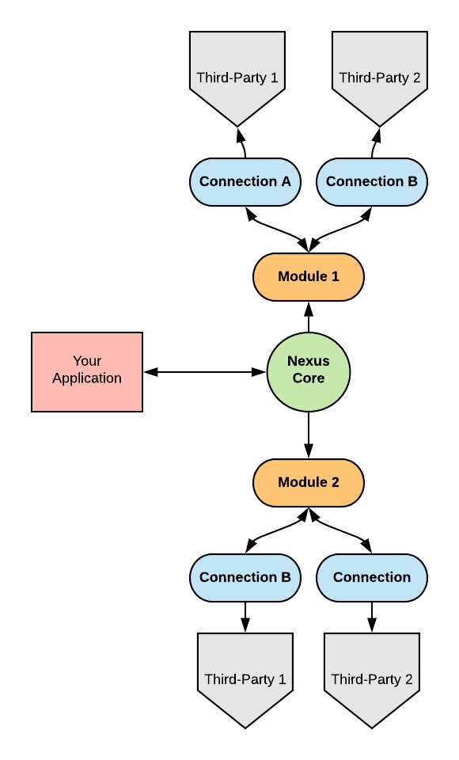
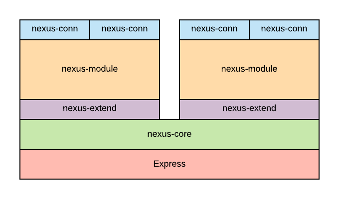

# Nexus Switchboard Core

Nexus is an application extension framework written in typescript that helps to establish _connections_ between third-party services through  _modules_.  

The core provides the means by which you your application can instatiate existing module and connection packages using the configuration you provide in your .nexus file which should be found in the root of your project.



In this diagram, *Your Application* is the node application *you* write which imports the nexus core and any modules you wish to use.  

A Nexus-based application can use any number of modules as each module establishes its own connection instances and third-party cconnections.  If the module exposes API endpoints, those endpoints' paths are guaranteed to be unique to the module.  But you can only have one module of each type per Nexus application.  

## Installation

To use Nexus in your app, you will first need to install the nexus-core package:

    npm install @nexus-switchboard/nexus-core

What you install next depends on what module you want to use.  For example if you wanted to use the dox module, you would install that module next.

    npm install @nexus-switchboard/nexus-mod-dox

## Configuration

The next step would be to use the .nexus configuration file to configure  the module and its connections.

The `.nexus` file should be found in the root of the project and has the following structure:

    {
      connections: [
        {
            name: <string>
            scope: <string> (optional)
        }
      ], 
      modules: {
        <module_name>: {
          config: <dict> 
          scope: <string> (optional)
          jobs: <dict> (optional)
        }
      } 
    }

### Connections

Even though your app does not use connections directly, they are defined here to allow the application creator to set any global connection configuration options that may be necessary.  Typically, though, there are no *global* configurations on the connection - rather, configuration is set at the module level. 

* **name**: The name of the configuration must match the name of connection package being used.  For example, *nexus-conn-slack*.
* **scope**: Scope refers to the npm package scope and is required if the connection is kept in the npm repo behind a scope.  For example, `nexus-switchboard`.  You should not include the `@` symbol.

### Modules

The Module level is where most of the configuration settings are kept.  Each module has the following  properties:

* **scope** - The scope of the module in the npm repo where it's kept (e.g. "nexus-switchboard")
* **config** - This is a list of configuration variables used by the module during instantiation and usage.  Each module will have its own set of configuration values.  See the documentation  for the module to figure out what should go here.
* **jobs** - Modules *can* support jobs.  A job is a unit of work that can be scheduled or run manually via global endpoint (this endpoint is managed by the core and does not have to be setup for each module).  Jobs have the following properties:
  * **type**: One of the job types available in the module.
  * **schedule**: If this should be run on a schedule, indicate the schedule using cron notation.
  * **config**: These are configuration options that are job-specific.  For example, if the job is updating a Confluence page, it might include the ID of the page that should be updated.  The module docs should include the possible configuration options.

## Application Integration 

Nexus can be integrated into an existing Express application or it can be included in a non-Express-based app.  In the latter case, behind the scenes, though, it will be instantiating Express.  Express is used to setup API endpoints for modules as well as the core endpoints for global handling  of certain operations.  

### Express

To integrate with your existing Express app, simply call the `addNexusToExpressApp` function, passing in the app to integrate with.

Note that you should avoid setting any body parsers at the _app_ level.  
That's because if any of the parsers modify the body prior to it reaching an integrated module, it might cause problems with the functioning of the module.

If you don't need to Express for any reason and are only bootstrapping Nexus, you can simply call `startNexusServer` passing in the port to listen on.  Nexus will take care of Express app creation and configuration.

# Extending Nexus

Most of the functionality in Nexus is found in Modules and Connections.  



## Connections

Connects are meant to represent a proxy to some external service - for example, slack or jira.  Creating your own connection involves creating a
class that is derived from `Connection` which is exported from the `nexus-extend` package.  

When creating your own connection, you do not have to include nexus-core - just `nexus-extend` to get access to the necessary functionality.  

### Connection Factory Function
In order to be a valid connection, your custom connection should export a factory function that has the `ConnectionFactory` signature.  Here is an example:

```typescript
export default function createConnection(cfg: ConnectionConfig): Connection {
    return new JiraConnection(cfg);
}
```

Where `JiraConnection` is a class derived from `Connection`.

### Connection Class

The connection class has two methods that must be implemented: `connect` and `disconnect` 

You should also initialize the name property trying to think of something relatively unique for readability.  That said, Nexus does not depend on name being globally unique.

#### Connect
The connect function is really just an opportunity to instatiate and store the client you are using to communicate with your service.  Or, if you are connecting directly then you can just use this to validate the configuration.

#### Disconnect
Useful if your connection needs to clean up memory, disengage cleanly with a service, etc.  You *probably* won't need to do anything here other than implement it.

#### Patterns
Think of the Connection object as a simple wrapper around a client library that allows it to integrate with Nexus more easily.  Derivation from Connection and the implementation of the connect and disconnect methods are required, everythign else is up to you.  

The audience for this object will be Modules. Modules will be calling methods on this object or refereencing its properties.  

When creating your own Connection and wrapping an existing client, it is recommended that you not re-implement the client methods as methods in the connection object then just turn around and call the client.  Instead, in the connect method, instantiate the client and ensure it's configured properly.  

Then expose the client as an `api` property and use the methods on the cilent instance.  You can then create convience methods on the connection class to provide some shortcuts for common tasks that are not available directly on the client library.

See the `nexus-conn-jira` example for more on this.

## Modules

The module is where the custom functionality lies.  Typically, modules do the work of pulling input from one connection and feeding it into another.  For example, you may have a module that listens for slack events and then creates tickets in Jira.  Or you might have a module that listens for Confluence events and sends emails through the Sendgrid connection.  And of course, you can have any number of connections associated with a module.  

There is nothing stopping you from listening for events from Slack then taking the input and doing a search on multiple connections and aggregate results before returning them to the Slack client.  

### Implementation

At the heart of a module is a class that is derived from the abstract NexusModule class which is made available in the `nexus-extend` package.  The only attribute that *must* be implemented is the name property by setting the name in the derived class.

```typescript
class DoxModule extends NexusModule {

    public name = "dox";

```

You have the option of overriding the following methods with each providing some type of functionality.  

#### loadConfig

The `loadConfig` method is an opportunity for your module to modify, verify, populate the configuration object that was given in the `.nexus` file of the main app.  Some important things to note here are:

* configs can have the special value of `__env__` which indicates that the value will be loaded by nexus-core from an envrionment variable which has the namespaced version of the config.  For example, if your config value is `SLACK_APP_ID` and your module name is `dox`, the environment variable that will be searched for will be `DOX_SLACK_APP_ID`.  This is to avoid module config name collisions.  That said, if the module does not have a unique name in your app, then the two modules configs *will* collide and which environment variables was set last will be the value that is used.  This makes it impossible to have two of the same module running in your Nexus-based app.

* If there are configuration values that *must* be set and you cannot use a default, then you should throw an exception at this point.  The module will fail to load and the user will get a log indicating the problem.  Other modules will continue to load, though.  

#### loadRoutes

This is called during module initialization and expects an array of `IRouteDefinition` objects to be returned.  Route definition include the following properties:

* **method** (required): [`get`,`post`,`put`,`delete`]
* **path** (required): [`string`] - The relative Uri path.  Note that this will be appended to the nexus path followed by the module root path.  For example: `/nexus/m/dox/[route_path]` would be the full path if you set the nexus root path to `/nexus` which is the default. 
* **protected** (optional, default=false): If set to true then this route will validate against an Auth0 client token before calling your handler
* **handler** (required): This is the function that will be called when the endpoint is hit (and validated).  It has the same signature as the Express request handler.
* **bodyParser** (optional): This is the middleware to use for parsing the body of the message before it reaches your handler.

For an example of a loadRoutes implementation see the [dox module](https://github.com/NexusSwitchboard/nexus-mod-dox/blob/master/src/routes/index.ts)

#### loadJobs

This is called during module initialization and expects the method to return an array of derived Job instances.  If your module has more than one type of Job, use the `jobDefinition.type` property to disambiguate.  

Treat this as a Job object factory returning a new instance for each job definition given.  

The Job definition objects given will specify the type, the schedule and the configuration.  Typically, you will pass the configuration into the job constructor.  The configuration comes from the job config given in the .nexus configuration for that module's job instance.  

It's important to note that a module can be configured to run multiple jobs of the same type (possibly with different schedules).  

Another important thing to remember is that Jobs can be triggered using a built-in endpoint in the Nexus core (see API below).

For an example of handling Job definition, check out the [dox module](https://github.com/NexusSwitchboard/nexus-mod-dox/blob/master/src/index.ts)

#### loadConnections

Most modules will use connections to respond to some type of request or trigger received by the module.  

What is being specified by the return value of this method is *NOT* actual Connection objects, but, rather, an array of which Connection objects this module could use and how to configure them when they are created.  

A `ConnectionRequestDefinition` is made up of two values:

* **name** - The name of the connection you want to support.  This name should match the name indicated in the .nexus file for your app (which should be the name of the npm package which contains the connection itself).  Note that if the connection being used in in an npm scope, we *do not* include that here.
* **config** - The configuration of the connection should be documented in the connection's readme.  The module will often populate the configuration with values that are set in the module's configuration object.   For example, the module may have a `CONFLUENCE_HOST` config property.  Use that to populate the `host` property of the `ConfluenceConnection` property.  The 
`loadConnections` method will receive the module's configuration object as a parameter.

In this example, we are setting the name to the connection we want to instantiate whenever a connection needs to be instantiated.  And we are passing the propert configuration values into the connection's config value:

```typescript
{
    name: "nexus-conn-confluence",
    config: {
        host: config.CONFLUENCE_HOST,
        username: config.CONFLUENCE_USERNAME,
        apiToken: config.CONFLUENCE_API_KEY
    },
},
```

Note: `config.CONFLUENCE_HOST` comes from the *module's* configuration setup in the .nexus file (see above)

